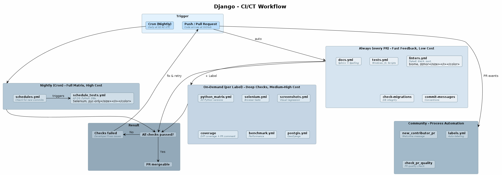

# GitHub Workflow - Analyse

Django nutzt **17 GitHub Actions Workflows** in `.github/workflows/` als CI/CT Infrastruktur. 
Folgende Analyse gruppiert sie nach ihrer Funktion im CI/CT-Lifecycle.

> **Hinweis:** Das Django-Projekt stellt ein Framework bereit und verfügt so über keine deploybaren Produkte. CD-Prozesse sind deshalb nicht gegeben.

---

## Workflow-Architektur

### Was sind GitHub Actions?

[GitHub Actions](https://docs.github.com/en/actions) ist eine in GitHub integrierte CI/CD-Plattform. 
GitHub beschreibt sie als *"a continuous integration and continuous delivery (CI/CD) platform that allows you to automate your build, test, and deployment pipeline"* ([Understanding GitHub Actions](https://docs.github.com/en/actions/about-github-actions/understanding-github-actions)). 

Die zentralen Komponenten sind:

- **Workflow**: Ein automatisierter Prozess, definiert als YAML-Datei im Verzeichnis `.github/workflows/` des Repositorys ([Workflows](https://docs.github.com/en/actions/about-github-actions/understanding-github-actions#workflows))
- **Event (Trigger)**: Das Ereignis, das einen Workflow auslöst - z.B. ein Push, ein Pull Request, ein Cron-Zeitplan oder das Setzen eines Labels ([Events](https://docs.github.com/en/actions/about-github-actions/understanding-github-actions#events))
- **Job**: Eine Gruppe von Schritten, die auf demselben Runner ausgeführt wird. Jobs innerhalb eines Workflows laufen standardmässig **parallel** ([Jobs](https://docs.github.com/en/actions/about-github-actions/understanding-github-actions#jobs))
- **Step**: Ein einzelner Schritt innerhalb eines Jobs - entweder ein Shell-Befehl (`run`) oder eine wiederverwendbare Action (`uses`) ([Steps](https://docs.github.com/en/actions/about-github-actions/understanding-github-actions#steps))
- **Action**: Eine wiederverwendbare Erweiterung (z.B. `actions/checkout`, `actions/setup-python`), die häufige Aufgaben kapselt ([Actions](https://docs.github.com/en/actions/about-github-actions/understanding-github-actions#actions))
- **Runner**: Die virtuelle Maschine, auf der ein Job ausgeführt wird. GitHub stellt Linux-, Windows- und macOS-Runner bereit ([Runners](https://docs.github.com/en/actions/about-github-actions/understanding-github-actions#runners))

### Übersicht der Workflow-Architektur

Das folgende Diagramm zeigt Django's 17 GitHub Actions Workflows - gruppiert nach ihrem Auslöser und ihren Kosten.

Ausgangspunkt sind zwei **Trigger**: 
- **Push bzw. Pull Request**:
Löst automatisch die **Always**-Workflows aus (tests, linters, docs, check-migrations, commit-messages) - schnelle, günstige Prüfungen, die bei **jedem** PR laufen.
Hängt ein Maintainer ein Label an den PR, werden zusätzlich die **On-Demand**-Workflows aktiviert (z.B. Selenium-Browsertests, Coverage, Benchmarks) - gezielte Tiefenprüfungen mit höheren Kosten.

- **Nächtlicher Cron-Job**:
Unabhängig der anderen Trigger, triggert der **Nightly**-Cron die vollständige Testmatrix (alle OS, alle Python-Versionen, alle Datenbanken).
Parallel dazu laufen bei PR-Events die **Community**-Workflows, die Prozessaufgaben wie Willkommensnachrichten und Auto-Labeling übernehmen.

Alle Prüfungsergebnisse fließen in das **Result**: 
* Bestehen alle Checks, ist der PR mergebar, schlägt eine Prüfung fehl, muss der Entwickler nachbessern und erneut pushen.



> **Kosten** bezeichnen hier den Verbrauch an GitHub Actions Runner-Minuten. Jeder Workflow-Job belegt einen Runner (virtuelle Maschine), dessen Laufzeit abgerechnet wird. 
Die Kosten hängen von drei Faktoren ab: der **Laufzeit** des Jobs, dem **Betriebssystem** des Runners (Linux ist am günstigsten) und der **Anzahl paralleler Jobs** in der Build-Matrix. Öffentliche Repositories wie dieses hier von Django erhalten diese Minuten kostenlos, die Ressourcen sind aber begrenzt. ([About billing for GitHub Actions](https://docs.github.com/en/billing/managing-billing-for-your-products/managing-billing-for-github-actions/about-billing-for-github-actions)).

| Kategorie | Workflows | Trigger | Kosten |
|---|---|---|---|
| **Immer** (bei jedem PR) | tests, linters, docs, check-migrations, commit-msgs | Push/PR | Niedrig |
| **On-Demand** (per Label) | python-matrix, selenium, screenshots, coverage, benchmark, postgis | Label | Mittel-Hoch |
| **Nightly** (Cron) | schedules + schedule_tests | Täglich | Hoch |
| **Community** | new-contributor, labels, pr-quality | PR-Events | Niedrig |

**Testintensität**:

- **Jeder PR** bekommt schnelle, günstige Checks (Linting, Basistests)
- **Kritische PRs** bekommen per Label teurere Checks (Selenium, Coverage)
- **Nächtlich** läuft die vollständige Matrix (alle OS, alle Python-Versionen, alle DBs)

---

## Grundkonzepte 

Bevor die einzelnen Workflows betrachtet werden, ist es zunächst lohnenswert sich den wiederkehrenden Konzepten bzw. Patterns zu widmen:

### Trigger: Wann läuft ein Workflow?

```yaml
on:
  pull_request:            # Bei jedem Pull Request
  push:
    branches: [main]       # Bei Pushes auf main
  schedule:
    - cron: '42 2 * * *'   # Täglich um 02:42 UTC (Nightly)
  workflow_dispatch:        # Manuell auslösbar
```

### Concurrency: Nicht doppelt laufen

```yaml
concurrency:
  group: ${{ github.workflow }}-${{ github.ref }}
  cancel-in-progress: true
```

Wenn ein Entwickler schnell hintereinander pusht, wird der **ältere** CI-Run abgebrochen. Das spart Rechenzeit und vermeidet verwirrende Ergebnisse.

### Permissions: Minimale Rechte

```yaml
permissions:
  contents: read
```

Jeder Workflow bekommt nur die Rechte, die er braucht. Das ist das **Principle of Least Privilege** -- ein kompromittierter Workflow kann keinen Code ändern, keine PRs schliessen, etc. .

### Caching: Schnellere Builds

```yaml
- uses: actions/setup-python@v6
  with:
    cache: 'pip'
    cache-dependency-path: 'tests/requirements/py3.txt'
```

Abhängigkeiten werden **zwischen Runs gecached**. 
Solange sich `requirements.txt` nicht ändert, müssen Pakete nicht neu heruntergeladen werden.

### Timeout: Schutz vor hängenden Jobs

```yaml
timeout-minutes: 60
```

Kein Job darf länger als 60 Minuten laufen. 
Schützt vor endlos laufenden Tests, die Ressourcen blockieren.

---

## Kategorie 1: Continuous Integration 

### `tests.yml` - Haupttests

**Konfigurationsdatei:** [`tests.yml`](https://github.com/django/django/blob/main/.github/workflows/tests.yml)

**Trigger:** Push auf `main`, Pull Requests (außer reine Docs-Änderungen)

* Minimaler Testlauf bei **jedem** PR (schnelles Feedback)
* Drei parallele Jobs:

| Job | Umgebung | Zu Testen |
|---|---|---|
| `windows` | Windows, SQLite, Python 3.14 | Cross-Platform-Kompatibilität |
| `javascript-tests` | Ubuntu, Node.js 20 | Admin-UI JavaScript |
| `scripts-tests` | Ubuntu, Python 3.14 | Hilfsskripte |

```yaml
- name: Run tests
  run: python -Wall tests/runtests.py -v2 # `-Wall` aktiviert alle Python-Warnungen 

```


---

### `python_matrix.yml` - Multi-Version-Tests

**Konfigurationsdatei:** [`python_matrix.yml`](https://github.com/django/django/blob/main/.github/workflows/python_matrix.yml)

**Trigger:** PRs mit Label `python-matrix` oder manuell

- Testet gegen **alle** unterstützten Python-Versionen
- **DRY (Don't Repeat Yourself)**: Die Python-Versionen stehen genau einmal in `pyproject.toml`; CI liest sie von dort, statt sie doppelt zu pflegen
- Die Versionen werden **dynamisch aus `pyproject.toml` extrahiert**:

```yaml
- id: set-matrix
  run: |
    python_versions=$(sed -n "s/^.*Programming Language :: Python :: \([[:digit:]]\+\.[[:digit:]]\+\).*$/'\1', /p" pyproject.toml ...)
    echo "python_versions=[$python_versions]" >> "$GITHUB_OUTPUT"
```

---

### `schedule_tests.yml` - Vollständige Testmatrix

**Konfigurationsdatei:** [`schedule_tests.yml`](https://github.com/django/django/blob/main/.github/workflows/schedule_tests.yml)

**Trigger:** Wird von `schedules.yml` nächtlich ausgelöst

- Umfangreichste Testlauf - enthält alles, was für jeden PR zu teuer wäre:

| Job | Besonderheit |
|---|---|
| Windows, Python 3.12/3.13/3.14/3.15-dev | Alle Versionen, inkl. Development |
| `pyc-only` | Django wird kompiliert, `.py`-Dateien gelöscht, Tests laufen nur mit `.pyc` |
| Selenium (SQLite + PostgreSQL) | Browser-Tests mit Chrome headless |
| PostgreSQL 16, 17, 18 | Mehrere DB-bemerkenswert

> Der `pyc-only`-Test ist bemerkenswert:
Er stellt sicher, dass Django auch in Produktionsumgebungen funktioniert, in denen nur kompilierte 
`.pyc`-Dateien ausgeliefert werden.

```yaml
- name: Prepare site-packages
  run: |
    DJANGO_PACKAGE_ROOT=$(python -c 'import site; print(site.getsitepackages()[0])')/django
    python -m compileall -b $DJANGO_PACKAGE_ROOT     # Kompilieren
    find $DJANGO_PACKAGE_ROOT -name '*.py' -delete    # Quelldateien löschen
```

---

### `schedules.yml` - Nächtlicher Trigger

**Konfigurationsdatei:** [`schedules.yml`](https://github.com/django/django/blob/main/.github/workflows/schedules.yml)

**Trigger:** Cron-Job täglich um 02:42 UTC

- Prüft, ob es in den **letzten 24 Stunden** neue Commits gab
- **Teure Tests laufen nicht bei jedem Commit**, sondern nächtlich - so werden Regressionen trotzdem zeitnah erkannt, ohne jeden PR zu verlangsamen
- Falls es neue Commits gab, triggert es `schedule_tests.yml`:

```yaml
schedule:
  - cron: '42 2 * * *'
```

---

## Kategorie 2: Continuous Testing 

### `linters.yml` - Statische Analyse

**Konfigurationsdatei:** [`linters.yml`](https://github.com/django/django/blob/main/.github/workflows/linters.yml)

**Trigger:** Push auf `main`, Pull Requests

Fünf parallele Linting-Jobs:

| Job | Tool | Prüft |
|---|---|---|
| `flake8` | [flake8](https://flake8.pycqa.org/) | Python-Stil (PEP 8), einfache Fehler |
| `isort` | [isort](https://pycqa.github.io/isort/) | Import-Reihenfolge |
| `black` | [Black](https://black.readthedocs.io/) | Code-Formatierung |
| `biome` | [Biome](https://biomejs.dev/) | JavaScript/CSS Qualität |
| `zizmor` | [zizmor](https://woodruffw.github.io/zizmor/) | Sicherheit der CI-Workflows |

```yaml
flake8:
  steps:
    - uses: liskin/gh-problem-matcher-wrap@e7b7beaaafa52524748b31a381160759d68d61fb
      with:
        linters: flake8
        run: flake8
```

> `gh-problem-matcher-wrap` sorgt dafür, dass Linter-Fehler direkt als Annotationen im Pull Request angezeigt werden - der Entwickler sieht den Fehler genau an der betroffenen Zeile.

**Beachte:** Die Action ist auf einen **Commit-SHA gepinnt** (`e7b7be...`), nicht auf ein Tag wie `v3`. 
Das ist die **Supply-Chain-Security**: 
Selbst wenn das Repository der Action kompromittiert wird, ändert sich der ausgeführte Code nicht.

---

### `check-migrations.yml` - Datenbank-Integrität

**Konfigurationsdatei:** [`check-migrations.yml`](https://github.com/django/django/blob/main/.github/workflows/check-migrations.yml)

**Trigger:** Änderungen an `models.py` oder Migrations-Dateien (Workflow läuft nur wenn sich relevante Dateien geändert haben)


```yaml
on:
  pull_request:
    paths:
      - 'tests/**/models.py'
      - 'tests/**/migrations/**'
```

Startet einen **PostgreSQL-Container** und prüft, ob alle Datenbank-Migrationen vorhanden sind:

```yaml
services:
  postgres:
    image: postgres:15-alpine
    options: >-
      --health-cmd pg_isready      # Wartet bis DB bereit
      --health-interval 10s
      --health-timeout 5s
      --health-retries 5
```

---

### `check_commit_messages.yml` - Konventionen prüfen

**Konfigurationsdatei:** [`check_commit_messages.yml`](https://github.com/django/django/blob/main/.github/workflows/check_commit_messages.yml)

**Trigger:** Pull Requests (edited, opened, synchronize, reopened)
 

Zwei Prüfungen:

1. **Prefix-Check** (nur `stable/*`-Branches): Commit-Messages müssen mit `[Version]` beginnen
   ```
   [5.1] Fixed #12345 - Beschreibung der Änderung.    # OK
   Fixed #12345 - Beschreibung.                       # FEHLER auf stable/5.1
   ```

2. **Suffix-Check** (alle Branches): Commit-Messages müssen mit einem Punkt enden
   ```
   Fixed #12345 - Beschreibung.    # OK
   Fixed #12345 - Beschreibung     # FEHLER
   ```

**Prozessqualität** wird getestet: Einheitliche Commit-Messages erleichtern das Lesen der Git-History und das automatische Generieren von Changelogs.

---


### `docs.yml` - Dokumentations-Build

**Konfigurationsdatei:** [`docs.yml`](https://github.com/django/django/blob/main/.github/workflows/docs.yml)

**Trigger:** Änderungen im `docs/`-Verzeichnis

```yaml
- name: Lint
  run: make lint               # Sphinx-Lint
- name: Black
  run: make black              # Code-Beispiele formatiert?
- name: Spelling
  run: SPHINXOPTS="-q -W" make spelling   # -W: Warnungen = Fehler
```

Die Dokumentation wird **ebenso getestet wie der Code**: 
Lint, Formatierung und Rechtschreibung müssen bestehen. `-W` macht Sphinx-Warnungen zu Fehlern.

---

## Kategorie 3: Tiefgehendere Qualitätssicherung (On-Demand)

Diese Workflows laufen nur, wenn ein Maintainer ein bestimmtes **Label** an den PR hängt. 
Das spart Ressourcen und gibt Maintainern Kontrolle.

### `selenium.yml` - Browser-Tests

**Konfigurationsdatei:** [`selenium.yml`](https://github.com/django/django/blob/main/.github/workflows/selenium.yml)

**Label:** `selenium`

Führt Tests mit einem echten Chrome-Browser (headless) aus - gegen SQLite und PostgreSQL:

```yaml
run: python -Wall runtests.py --selenium=chrome --headless --parallel 1
```

---

### `screenshots.yml` - Visual Regression Tests

**Konfigurationsdatei:** [`screenshots.yml`](https://github.com/django/django/blob/main/.github/workflows/screenshots.yml)

**Label:** `screenshots`

Erstellt Screenshots der Django-Admin-Oberfläche und lädt sie als Artefakte hoch:

```yaml
- run: python -Wall runtests.py --selenium=chrome --headless --screenshots
- name: Optimize screenshots
  run: oxipng --interlace=0 --opt=4 --strip=safe tests/screenshots/*.png
- uses: actions/upload-artifact@v4
  with:
    name: screenshots-${{ github.event.pull_request.head.sha }}
```

So können Reviewer UI-Änderungen visuell vergleichen.

---

### `coverage_tests.yml` + `coverage_comment.yml` - Code Coverage

**Konfigurationsdateien:** [`coverage_tests.yml`](https://github.com/django/django/blob/main/.github/workflows/coverage_tests.yml), [`coverage_comment.yml`](https://github.com/django/django/blob/main/.github/workflows/coverage_comment.yml)

**Label:** `coverage`

Ein zweistufiger Workflow:

1. **`coverage_tests.yml`**: Führt Tests mit Coverage-Messung aus und erzeugt einen **Diff-Coverage-Report**. Im Gegensatz zu einem klassischen Coverage-Report, der die gesamte Codebasis bewertet, misst Diff-Coverage nur die Testabdeckung der im PR **neu hinzugefügten oder geänderten Zeilen**. So wird aufgezeigt, ob der **neue Code durch Tests abgedeckt** ist.
2. **`coverage_comment.yml`**: Postet den Report als Kommentar auf den PR

```yaml
# Stufe 1: Coverage messen
- run: python -Wall tests/runtests.py --settings=test_postgres -v2
- run: |
    python -m coverage combine
    python -m coverage report --show-missing
    python -m coverage xml
    diff-cover tests/coverage.xml --compare-branch=origin/main

# Stufe 2: Auf PR posten (separater Workflow für Sicherheit)
on:
  workflow_run:
    workflows: ["Coverage Tests"]
    types: [completed]
```

Die Trennung in zwei Workflows ist eine **Sicherheitsmaßnahme**: `coverage_comment.yml` braucht Schreibrechte auf PRs. 
Wenn das im selben Workflow wie die Tests liefe, könnte ein bösartiger PR diese Rechte missbrauchen. 
Durch `workflow_run` läuft der Kommentar-Workflow im Kontext des Basis-Repos, nicht des PR-Forks.

---

### `benchmark.yml` - Performance-Tests

**Konfigurationsdatei:** [`benchmark.yml`](https://github.com/django/django/blob/main/.github/workflows/benchmark.yml)

**Label:** `benchmark`

Nutzt [ASV (Airspeed Velocity)](https://asv.readthedocs.io/) zum Messen von Performance-Regressionen. 
> ASV führt definierte Benchmarks (z.B. Datenbankabfragen, Template-Rendering) wiederholt gegen zwei Git-Commits aus und vergleicht die gemessenen Ausführungszeiten statistisch. :

Vergleicht die Performance von `HEAD^` (vorheriger Commit) mit `HEAD` (aktueller Commit). 
Durch das wiederholte bzw. kontinuierliche Ausführen mit verschränkten (also verketteten) Prozessen (`--interleave-processes`) werden Schwankungen durch Systemlast minimiert, sodass echte Regressionen von Messrauschen unterschieden werden können
**Der Job schlägt fehl, wenn die Performance deutlich sinkt.**

```yaml
- run: |
    asv continuous --interleave-processes -a processes=2 --split --show-stderr 'HEAD^' 'HEAD'
    if grep -q "PERFORMANCE DECREASED" out.txt; then
      exit 1     # Workflow schlägt fehl bei Performance-Regression
    fi
```

Die Benchmark-Definitionen liegen im separaten Repository [django/django-asv](https://github.com/django/django-asv) und decken zentrale Django-Bereiche ab 
(z.B. Datenbankabfragen oder Request/Response-Handling). 
ASV erkennt Methoden mit dem Prefix `time_` automatisch als Benchmark und misst deren Ausführungszeit. 
`setup()` wird vor jeder Messung ausgeführt, geht aber nicht in die gemessene Zeit ein.

Ein konkretes Beispiel ist der [`query_filter`-Benchmark](django/django-asv/benchmarks/query_benchmarks/query_filter/benchmark.py), der die Ausführungszeit von ORM-Filterabfragen misst:

```python
from ...utils import bench_setup
from .models import Book

class QueryFilter:
    def setup(self):
        bench_setup(migrate=True)

    def time_query_filter(self):
        list(Book.objects.filter(id=1))
        list(Book.objects.filter(id=2))
        list(Book.objects.filter(id=3))
        # ... 
```

---

### `postgis.yml` - GeoDjango-Tests

**Konfigurationsdatei:** [`postgis.yml`](https://github.com/django/django/blob/main/.github/workflows/postgis.yml)

**Label:** `geodjango`

Testet die [GeoDjango](https://docs.djangoproject.com/en/5.2/ref/contrib/gis/)-Erweiterung gegen mehrere [PostGIS](https://postgis.net/)-Versionen. 
>PostGIS ist eine Erweiterung für PostgreSQL, die räumliche Datentypen (Geometrien, Geographien), räumliche Indizes und Funktionen (z.B. Distanzberechnungen, Flächenverschneidungen) anbietet. 

```yaml
strategy:
  fail-fast: false
  matrix:
    postgis-version: ["latest", "18-3.6-alpine", "17-master"]
```

`fail-fast: false` bedeutet: Wenn eine Version fehlschlägt, laufen die anderen trotzdem weiter. 
So sieht man alle Probleme auf einmal.

---

## Kategorie 4: Sonstige Prozesse (Open-Source-Community)

### `new_contributor_pr.yml` - Willkommensnachricht

**Konfigurationsdatei:** [`new_contributor_pr.yml`](https://github.com/django/django/blob/main/.github/workflows/new_contributor_pr.yml)

**Trigger:** Erster PR eines neuen Contributors

```yaml
- uses: actions/first-interaction@v1
  with:
    pr-message: |
      Hello! Thank you for your contribution!
      As it's your first contribution be sure to check out the patch review checklist...
```

**Automatisches Onboarding**: Neue Contributors bekommen sofort hilfreiche Links.

---

### `labels.yml` - Automatisches Labeling

**Konfigurationsdatei:** [`labels.yml`](https://github.com/django/django/blob/main/.github/workflows/labels.yml)

**Trigger:** PR erstellt oder bearbeitet

Prüft, ob der PR-Titel eine Trac-Ticketnummer enthält (z.B. `#12345`). 
Falls nicht, wird automatisch das Label `no ticket` hinzugefügt für eine konsistente History.

---

### `check_pr_quality.yml` - PR-Qualitätsprüfung

**Komnfigurationsdatei:** [`check_pr_quality.yml`](https://github.com/django/django/blob/main/.github/workflows/check_pr_quality.yml)

**Trigger:** PR erstellt oder bearbeitet

Führt ein Python-Skript ([`scripts/pr_quality/check_pr.py`](https://github.com/django/django/blob/main/scripts/pr_quality/check_pr.py)) aus, das die PR-Qualität prüft. 

Konkret werden folgende Checks durchgeführt:

| Check | Prüft | Severity |
|---|---|---|
| **Trac-Ticket referenziert** | Ist ein Trac-Ticket verlinkt? (bei trivialen PRs < 80 Zeilen reicht "N/A") | Error |
| **Trac-Ticket bereit** | Ist das Ticket im Status "Accepted" oder "Ready for checkin"? | Error |
| **has_patch-Flag gesetzt** | Ist das Trac-Ticket als "hat Patch" markiert? | Warning |
| **Ticketnummer im PR-Titel** | Enthält der PR-Titel die Ticketnummer (z.B. `#36991`)? | Warning |
| **Branch-Beschreibung vorhanden** | Wurde eine aussagekräftige Beschreibung (mind. 5 Wörter) ausgefüllt? | Error |
| **AI-Disclosure ausgefüllt** | Wurde offengelegt, ob AI-Tools verwendet wurden? (seit Januar 2026) | Error |
| **Checkliste abgehakt** | Sind die ersten fünf Punkte der PR-Checkliste angekreuzt? | Error |

> - Checks mit Severity **Error** führen bei Erstcontributorn dazu, dass der PR automatisch geschlossen und ein Kommentar mit Hinweisen gepostet wird. 
> - **Warnings** erzeugen lediglich einen informativen Kommentar. 
> - Etablierte Contributor (>= 5 Commits in den letzten 3 Jahren) werden von allen Checks ausgenommen.

Der Workflow nutzt `pull_request_target` mit einem wichtigen Sicherheitspattern:

```yaml
- uses: actions/checkout@v6
  with:
    ref: ${{ github.event.repository.default_branch }}   # Nicht den PR-Branch!
```

Der Workflow checkt den **Basis-Branch** aus, nicht den PR-Head. 
So kann ein bösartiger PR den Workflow-Code nicht verändern.

---

