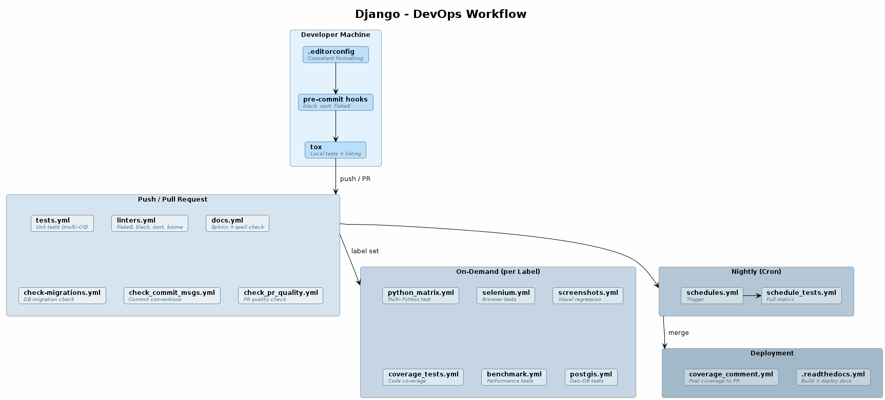

# Django - Analyse

## Django?

[Django](https://www.djangoproject.com/) ist ein Python-Web-Framework mit über 30.000 Commits und über 2.000 Contributors. 
Aufgrund seiner Größe, als eines der größten Open-Source-Projekte, hat es ausgereifte DevOps-Prozesse - etwa eine CI/CD-Infrastruktur -, die sich als Referenzbeispiel eignen.

- **Repository**: [github.com/django/django](https://github.com/django/django)
- **DevOps-Plattform**: [GitHub Actions](https://github.com/features/actions)

## Übersicht - DevOps Workflow

Djangos CI/CD-Pipeline ist in fünf Phasen aufgebaut, die aufeinander aufbauen.
Zunächst werden die Änderungen lokal, bevor der Code das Repository erreicht, mittels Tools wie Pre-Commit-Hooks und Tox auf dem Rechner des Entwicklers geprüft.
Nach einem Push oder Pull Request übernimmt weiter GitHub Actions und führt automatisch Tests, Linting und weitere Prüfungen durch.
Aufwändigere Checks - etwa Browser-Tests mit Selenium oder Performance-Benchmarks - laufen nur **on-demand**, wenn ein entsprechendes Label auf den Pull Request gesetzt ist (z.B. `run selenium`).
Ergänzend dazu testet ein nächtlicher Cron-Job die gesamte Python-Versionsmatrix, um Regressionen frühzeitig zu erkennen.
Nach einem Merge werden abschließend die Dokumentation deployed und Coverage-Ergebnisse auf dem PR gepostet.

## Übersicht - DevOps Konfigurationen 

| Datei | Typ | Beschreibung |
|--|--|--|
| [`.pre-commit-config.yaml`](https://github.com/django/django/blob/main/.pre-commit-config.yaml) | Lokales Tooling | Pre-Commit Hooks (black, isort, flake8, biome, zizmor) |
| [`tox.ini`](https://github.com/django/django/blob/main/tox.ini) | Lokales Tooling | Lokale Test- und Lint-Umgebung |
| [`.editorconfig`](https://github.com/django/django/blob/main/.editorconfig) | Lokales Tooling | Editor-übergreifende Formatierungsregeln |
| [`.flake8`](https://github.com/django/django/blob/main/.flake8) | Konfiguration | Flake8-Linter-Einstellungen |
| [`pyproject.toml`](https://github.com/django/django/blob/main/pyproject.toml) | Konfiguration | Build-Config + Black/isort-Settings |
| [`biome.json`](https://github.com/django/django/blob/main/biome.json) | Konfiguration | JavaScript/CSS Linter + Formatter |
| [`zizmor.yml`](https://github.com/django/django/blob/main/zizmor.yml) | Konfiguration | Sicherheitsscanner für CI-Workflows |
| [`.readthedocs.yml`](https://github.com/django/django/blob/main/.readthedocs.yml) | Deployment | Read the Docs Konfiguration |
| [`.github/workflows/`](https://github.com/django/django/blob/main/.github/workflows/) | CI/CD | 17 GitHub Actions Workflows |
| [`.github/pull_request_template.md`](https://github.com/django/django/blob/main/.github/pull_request_template.md) | Prozess | Standardisierte PR-Checkliste |

## Detailanalysen

- **[Lokale Tools](lokale-tools.md)** - Pre-Commit, Tox, EditorConfig, Linter-Konfigurationen
- **[GitHub Workflows](workflows.md)** - Alle 17 GitHub Actions Workflows im Detail

## Prinzipien

Django wendet folgende CI/CD-Prinzipien an, die in den Detailanalysen jeweils am konkreten Beispiel erklärt werden:

1. **Shift Left** - Fehler so früh wie möglich finden (Pre-Commit vor CI)
2. **Least Privilege** - Workflows bekommen nur die minimal nötigen Berechtigungen
3. **Concurrency Control** - Alte CI-Runs werden bei neuen Pushes abgebrochen
4. **Intelligente Filterung** - Nur relevante Tests werden getriggert (`paths-ignore`, `paths`)
5. **On-Demand-Testing** - Teure Tests (Selenium, Coverage, Benchmarks) nur bei Bedarf per Label
6. **Matrix-Testing** - Tests gegen mehrere Python-Versionen, Betriebssysteme und Datenbanken
7. **DRY** - Python-Versionen werden aus `pyproject.toml` extrahiert statt doppelt gepflegt
8. **Supply-Chain-Security** - Actions auf Commit-SHAs gepinnt, zizmor scannt Workflows
9. **Docs as Code** - Dokumentation wird genauso getestet wie Quellcode
